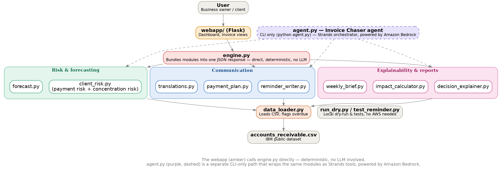

<div align="center">

# 🧾 Invoice Chaser

### An AI agent that chases down unpaid invoices — so freelancers and small business owners don't have to.

[](https://strandsagents.com)
[](https://aws.amazon.com/bedrock/)
[](https://www.python.org/)
[](LICENSE)

**Built for the AWS "Agents for Humans" Hackathon — Professional Agents track**

[Live Demo](#) · [Devpost Submission](#) · [Report a Bug](../../issues)

</div>

---

## 📌 The Problem

Freelancers and small business owners lose real money to late-paying clients — not because clients refuse to pay, but because **chasing payment is awkward, easy to forget, and takes real time**. Most people either:

- 🙈 Let overdue invoices slide because sending a reminder feels uncomfortable, or
- 📢 Send the same generic nudge to every client regardless of how overdue they are — risking being either too soft (ignored) or too aggressive (damaged relationship)

Meanwhile, unpaid invoices quietly wreck cash flow — the **#1 reason small businesses run into trouble**.

## 🎯 Who It's For

Freelancers, consultants, and small business owners who invoice clients directly and don't have a dedicated accounts-receivable team following up on their behalf.

## 💡 Why It Matters

A few days of delay on enough invoices can be the difference between making payroll and missing it. Invoice Chaser turns *"I should really follow up on that"* into something that just happens — consistently, and with the right tone every time.

---

## ✨ What It Does

Invoice Chaser is an agent that works through a business's invoice ledger and takes real action, end to end:

| Capability | Description |
|---|---|
| 🔍 **Scans open invoices** | Identifies which invoices are overdue, and by how many days |
| 🚦 **Classifies urgency** | Four escalating tiers — *gentle → polite follow-up → firm → urgent* — based on how overdue each invoice is |
| ✍️ **Drafts ready-to-send reminders** | Tone matched to urgency, so escalation feels natural instead of robotic or aggressive |
| 🤝 **Negotiates payment plans** | Suggests realistic installment options for clients who need flexibility |
| 📊 **Assesses client risk** | Scores clients on likelihood of paying late based on their payment history |
| 📈 **Forecasts cash flow** | Projects how much money is tied up in unpaid invoices, and how much is genuinely at risk |
| 🧠 **Explains its decisions** | Surfaces *why* the agent flagged or prioritized an invoice the way it did |
| 🗓️ **Generates a weekly brief** | A digestible summary of what needs attention this week |
| 🌐 **Multi-language reminders** | Draft translation support for reaching international clients |
| 🎯 **Flags customer concentration** | Warns when too much outstanding AR is tied up in a single client |

This isn't a dashboard that just shows you numbers — it's an agent that does the follow-up work itself.

---

## 📊 Data-Driven Design
Every threshold in this project (reminder tiers, risk levels, concentration flags) was validated against the real IBM dataset rather than picked arbitrarily. [See the analysis notebook](link).

---

## 🖥️ Web Dashboard

Invoice Chaser ships with a Flask-powered web app so you don't have to run scripts from the command line — browse your invoice ledger, see risk scores, and review generated reminders in one place, in light or dark mode.

---

## 🏗️ Architecture

<div align="center">

</div>

The project is split into layers on purpose:

- **Rule-based modules** (`client_risk.py`, `forecast.py`, `reminder_writer.py`, `payment_plan.py`, `translations.py`, `decision_explainer.py`, `impact_calculator.py`, `weekly_brief.py`) — fully deterministic, testable on their own, no AWS dependency required.
- **Agent layer** (`agent.py`) — wraps the rule-based modules as Strands **tools**, so the agent can reason about *when* to use each one and answer free-form questions like *"how much am I owed right now?"* or *"draft a follow-up for invoice X."*
- **Web layer** (`webapp/`) — a Flask app that exposes the ledger, risk scores, and generated reminders through a browser dashboard.

This means the core automation is provably solid on its own — the LLM adds a natural-language interface on top of logic that already works.

---

## 🛠️ Tech Stack

- **[Strands Agents SDK](https://strandsagents.com)** — agent framework and tool orchestration
- **Amazon Bedrock** — LLM backend for the agent
- **Python** — core logic (pandas for data processing)
- **Flask** — web dashboard
- **Data**: [IBM Accounts Receivable — Late Payment Histories](https://www.kaggle.com/datasets/hhenry/finance-factoring-ibm-late-payment-histories) (public dataset, used to simulate a realistic invoice ledger)

---

## 📂 Project Structure

```
invoice-chaser/
├── data/
│   └── accounts_receivable.csv     # invoice ledger (IBM public dataset)
├── src/
│   ├── data_loader.py              # loads data, detects overdue invoices, cash flow logic
│   ├── client_risk.py              # client-level payment risk scoring
│   ├── forecast.py                 # cash flow forecasting
│   ├── reminder_writer.py          # tone-tiered reminder message drafting
│   ├── payment_plan.py             # payment plan negotiation logic
│   ├── translations.py             # multi-language reminder support
│   ├── decision_explainer.py       # explains the agent's reasoning per invoice
│   ├── impact_calculator.py        # quantifies financial impact of overdue invoices
│   ├── weekly_brief.py             # generates the weekly summary
│   ├── run_dry.py                  # runs the core pipeline without AWS (for testing/demo)
│   ├── test_reminder.py            # unit tests for reminder logic
│   └── agent.py                    # Strands Agent — wraps the above as tools
├── webapp/
│   ├── app.py                      # Flask app entry point
│   ├── engine.py                   # bundles all modules into one JSON response for the API
│   └── ...                         # templates, static assets, dashboard views              
├── script/                         # utility scripts
├── smoke_test.py                   # end-to-end smoke test
├── architecture.png                # architecture diagram
├── requirements.txt
└── README.md
```

---

## 🚀 Running It

### Core agent (CLI)

```bash
python -m venv venv
venv\Scripts\activate            # Windows
pip install -r requirements.txt

# Test the core logic without any AWS setup:
cd src
python run_dry.py

# Run the full conversational agent (needs AWS credentials configured):
python agent.py
```

### Web dashboard

```bash
cd webapp
python app.py
```

Then open `http://localhost:5000` in your browser.

---

## 📊 Data Note

This project uses IBM's publicly available **Accounts Receivable — Late Payment Histories** dataset (Kaggle). It's a well-known, IBM-published sample dataset with realistic invoice/payment patterns — it is not a live company's private financial data. Since the dataset is historical (every invoice has a settlement date), we simulate a "snapshot" date and treat any invoice settled after that date as still open — giving the agent a realistic, point-in-time invoice ledger to work from.

---

## 👥 Team

| Name | Role | Where are we from | About Us |
|---|---|----|-----|
| [Kanak Baghel](https://www.linkedin.com/in/kanakbaghel/) | Lead / Organizer & Backend Development | Greater Delhi Area, India |  Data Science & Business Analytics Graduate, Experienced at TechNest & IIT Guwahati (Emeritus) |
| [Usman Oluwakemisola Eve](https://www.linkedin.com/in/usman-oluwakemisola-eve/) | Data Analysis & QA | Abuja, Federal Capital Territory, Nigeria | Advanced Business Intelligence(BI) Analyst |
| [Rahma Shahbaz](https://www.linkedin.com/in/rahma-shahbaz-660841378/) | Frontend Development | Sahiwal, Punjab, Pakistan | Aspiring AI & Frontend Developer and Azure AI Fundamentals Certified |
| [Nana Bonsu](https://www.linkedin.com/in/nana-bonsu/) | AWS & Agent Architecture | Bronx, New York, United States | Software Engineer, Building AI-Powered Mobile & Web Applications |
---

## 📄 License

MIT — see [LICENSE](LICENSE).
